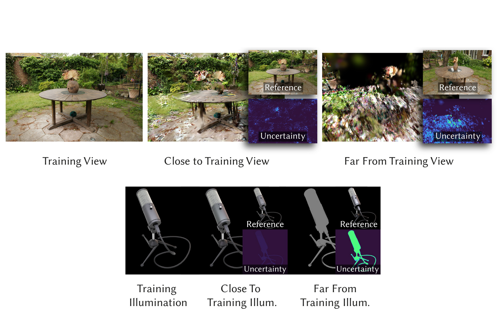

# Manifold Sampling for Differentiable Uncertainty in Radiance Fields

Pytorch implementation of [Manifold Sampling for Differentiable Uncertainty in Radiance Fields ](https://vcai.mpi-inf.mpg.de/projects/2024-ManifoldUncertainty/).

Proceedings of SIGGRAPH Asia, 2024

[Linjie Lyu](https://people.mpi-inf.mpg.de/~llyu/)<sup>1</sup>,
 [Ayush Tewari](https://ayushtewari.com/)<sup>2</sup>,
 [Marc Habermann](https://people.mpi-inf.mpg.de/~mhaberma/)<sup>1</sup>,
 [Shunsuke Saito](https://shunsukesaito.github.io/)<sup>3</sup>,
 [Michael Zollhöfer](https://zollhoefer.com/)<sup>3</sup>,
 [Thomas Leimkühler](https://people.mpi-inf.mpg.de/~tleimkue/)<sup>1</sup>,
and 
 [Christian Theobalt](https://people.mpi-inf.mpg.de/~theobalt/)<sup>1</sup>
 
 
 <sup>1</sup>Max Planck Institute for Informatics,Saarland Informatics Campus , <sup>2</sup>MIT CSAIL,<sup>3</sup>Meta Codec Avatars Lab
 


## Installation
Please follow [Gaussian Splatting](https://github.com/graphdeco-inria/gaussian-splatting/tree/main) to set up the environment.
To use the Laplace Approximation baseline from [FisherRF](https://github.com/JiangWenPL/FisherRF), please follow their instruction to install their modified renderer.

This code is tested with CUDA 12.1
```python
conda activate gaussian_splatting
pip install torch torchvision  --index-url https://download.pytorch.org/whl/cu121
```

## Dataset Preparation
NeRF data can be downloaded from [NeRF](https://www.matthewtancik.com/nerf)
and MipNeRF360 data can be downloaded from [MipNeRF360](https://jonbarron.info/mipnerf360/). We thank the authors for sharing the data.

## Camera Selection
```python
data_path='.../data/nerf_synthetic/mic'
out_path='.../results/mic_VIMC' 
python -u active_cam.py -s $data_path -m $out_path  --eval  --method=VI_MC --iterations 2000  --cam_seqeunce 0   --num_views 10 --with_uncertainty  --bg_weight 0. --rank 2 --random_init_pcd  
```
For real-world data:
```python
data_path='.../data/360_v2/bicycle'
out_path='.../results/bicycle_IMC' #
python -u active_cam.py -s $data_path -m $out_path  --eval   --method=VI_MC --iterations 2000  --cam_seqeunce 0   --num_views 20 --with_uncertainty  --bg_weight 0. --rank 2 --random_init_pcd  --resolution 8
```
## Camera Optimization
This is the code for differentiable camera optimization. 

First of all, please use the vanilla [Gaussian Splatting](https://github.com/graphdeco-inria/gaussian-splatting/tree/main) to pre-train a finegrained model, and put the pointcloud folder 
under the data_path. This is used to for active capture. Every time the next camera is optimized, we capture the image. Ideally this should be done 
with blender. For efficiency, we use the pre-trained model as a replacement of renderer. 
```python
data_path='.../data/nerf_synthetic/mic'
out_path='.../results/mic_dcam' 
python -u active_dcam.py -s $data_path -m $out_path  --eval  --method=VI_MC --iterations 2000  --cam_seqeunce 0   --num_views 10 --with_uncertainty  --bg_weight 0. --rank 0 --random_init_pcd
```
Note you can select different initialization camera position for optimization with --method command. Please refer [here](./active/__init__.py) for more details.

## SH light Optimization

Cooming soon.


## Citation
```python
@InProceedings{lyu2024manifold,
title={Manifold Sampling for Differentiable Uncertainty in Radiance Fields},
author={Lyu, Linjie and Tewari, Ayush and Habermann, Marc and Saito, Shunsuke and Zollh{\"o}fer, Michael and Leimk{\"u}ehler, Thomas and Theobalt, Christian},
booktitle = {SIGGRAPH Asia Conference Proceedings},
year      = {2024},
doi       = {10.1145/3680528.3687655},
}
```
## Acknowledgments
This code is heavily based on the [Gaussian Splatting](https://github.com/graphdeco-inria/gaussian-splatting/tree/main), and [FisherRF](https://github.com/JiangWenPL/FisherRF) codebases. We greatly appreciate the authors for sharing their code.